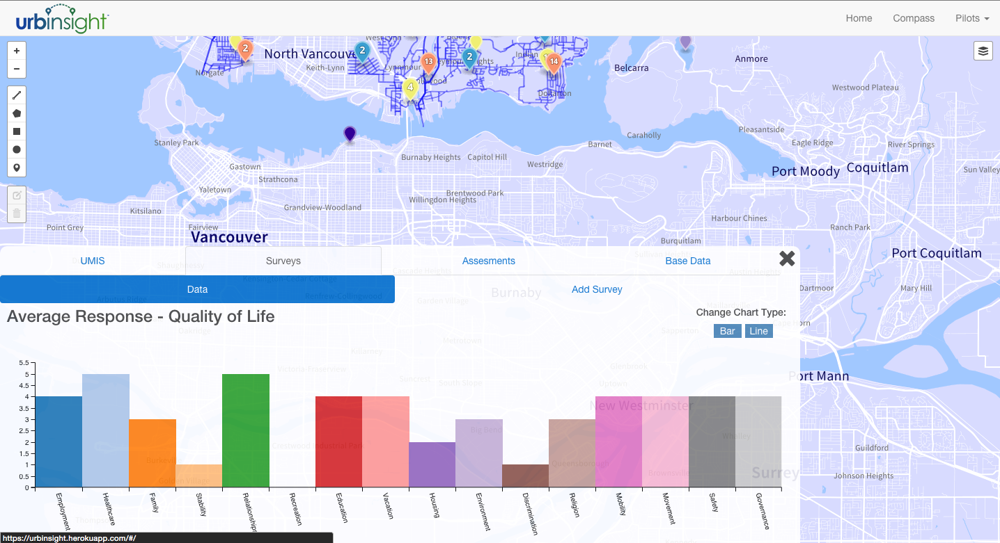
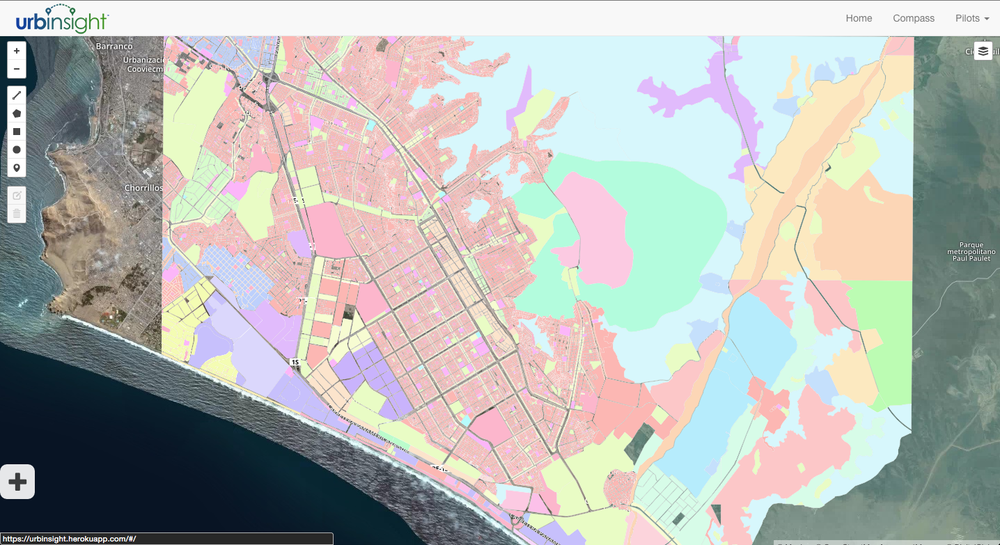
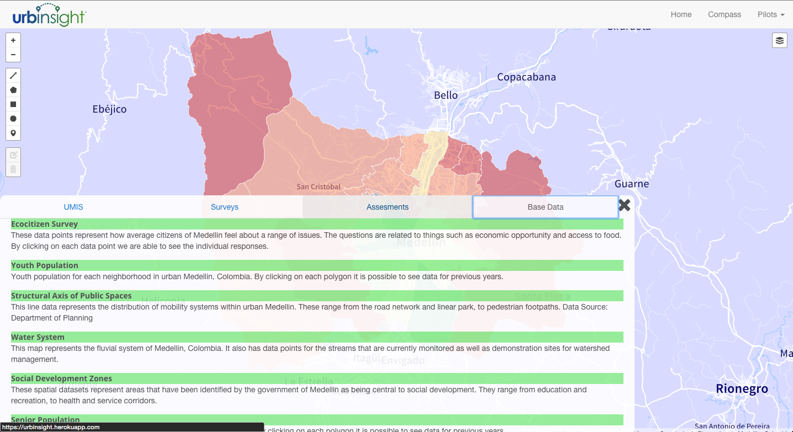

# Urbinsight

Urbinsight is a data visualization platform used to analyze environmental data for cities globally. The project was built for Ecocity Builders, which is an environmental nonprofit base out of Oakland, California. The platform is used to view relevant map layers, as well as user input data based on Quality of Life survey, and parcel audits, which are used to understand resource use.

## Overview

* Created map layers using GeoNode and GeoServer
* Developed a backend API to allow for dynamic data transformations related to cities.
* Implemented MongoDB, and PostgreSQL for different data needs. PostgreSQL using PostGIS implementation allows for Dynamic Parcel Mapping
* Created spatial queries using PostGIS and MongoDB Geospatial API
* Single Page Application using React, Redux, Koa, and NodeJS
* Created architecture to allow for dynamic chart generation using D3.js and the C3.js libraries

## UMIS

This application serves as a visual interface for a much larger information system called Urban Metabolism Information System or UMIS. This system was developed by researchers at the IMF, and is seen as a tool to understand how resource use is affected spatially, and across which use cases are the most impactful. This is a prototype for a possible larger implementation that could be used by urban planners, architects, and designers, to design more sustainable cities.

In order to implement this model I had to build the entire data object in a document store, and translate the requisite functions into a built-in library that would transform the data in a way that can be visualized. This was then connected to the scrolling functionality of the map so that it was possible to pan around the map, and get the data for the area in view.

## Design

The aim of this application was to build a coherent interface that could be used by multiple different types of users and provide important data in a way that was not overwhelming for people who are not used to viewing city level data. I wanted it to be pleasing to the eye, while also being powerful, and in this way many of the data generation features are hidden in a way that allows for seamless data viewing.

Creating a dynamic dashboard proved pretty challenging in that state across the application had to be managed in a way that didn't create problems with the different watchers that were updating based on each data type.

* I made custom maps that were visually pleasing but not distracting. Often government data is presented in a way that is at times stoic and bland, I wanted to create an interface that was appealing to a larger range of users and ages.
* Dynamic AJAX calls are created automatically through map interaction which allows for seamless data rendering and interaction.
* Switching between cities is straightforward and the user is provided feedback about missing data.

### Screenshots

*Demand Summary Table Visualization*

*Quality of Life Survey Visualization*

*Peru Zoning Map*

*Base Layer Information*

## Improvements / Desired Functionality
* Full UMIS implementation build out.
* Spatial Sankey diagrams to understand how resources move across geographic regions.
* Implement Users Profiles for session persistence and retrieval.
* Allow for users to add data for arbitrary cities.

I plan to continue to develop this application to perfect the UI and data analysis tools.

## Deployment

Urbinsight is deployed at [www.urbinsight.com][site].

[site]: http://www.urbinsight.com

## Global Dependencies
1. MongoDB
2. PostGreSQL

## Development
1. Download the repository
2. Run `npm install` in the top level urbinsight directory, and the parcel-server folder
3. Start a mongo server using the command `mongod --dbpath data/db/ --logpath data/logs/mongodb.log --logappend`
4. Make sure PostgreSQL is running and use `createdb urbinsight` to create a database called urbinsight
5. `cd` into the urbinsight/server-parcel folder and run `npm start` this is parcel tile server it runs on port 5001
6. `cd` into the urbinsight/server folder and run `node server.js` this is the application server it runs on port 8001
7. From the main urbinsight folder run `npm run dev:no-debug` this is the Hot Module Replacement Server running on port 3000
8. Go to `http://localhost:3000` to see Urbinsight running
